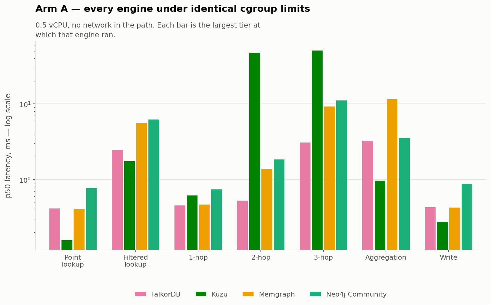
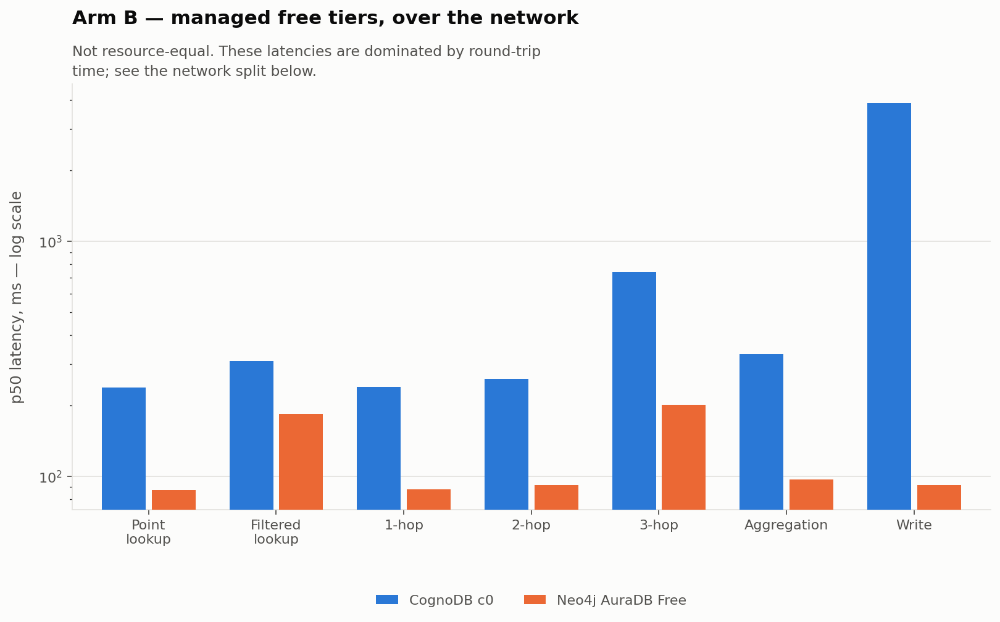
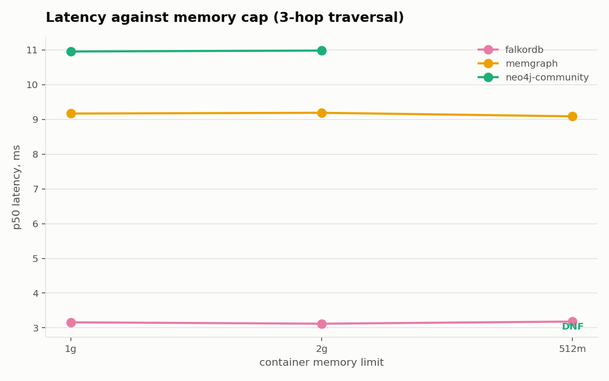
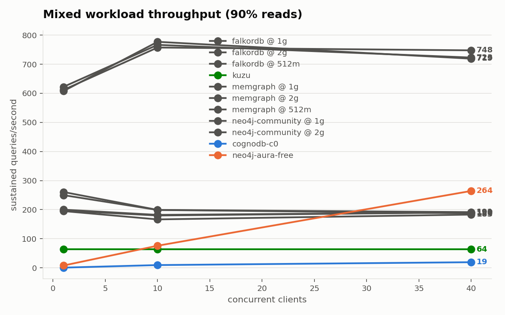
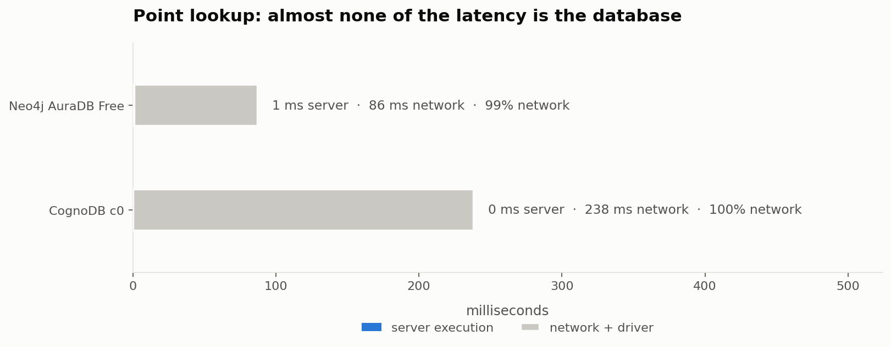
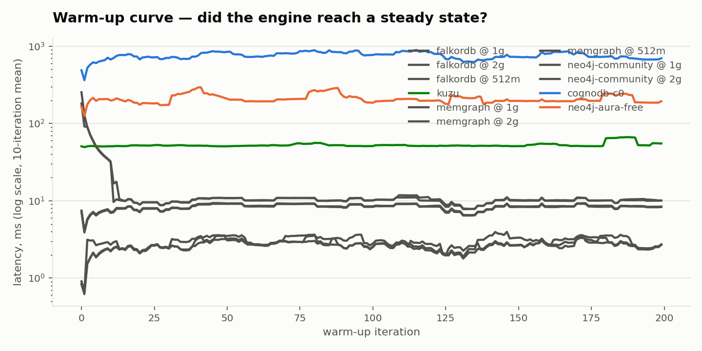

# Graph database benchmark: CognoDB Cloud and four others

A resource-parity benchmark of five graph databases on one dataset and one set
of workloads, with the network separated from the database rather than folded
into it.

**Every number in [`results/RESULTS.md`](results/RESULTS.md) is generated by
`make report` from raw per-iteration data. None is typed by hand.**

---

## The short version

Four findings, in order of how much they surprised me.

### 1. The managed graph database free tier is nearly extinct

Of seven managed graph platforms surveyed in August 2026, **two still offer a
free tier that survives a week.** The rest are 14-day trials that delete your
data, or — in TigerGraph's case — were withdrawn in November 2024.

That is not a preamble to the benchmark. It is the reason the benchmark is
shaped the way it is: "run every platform's free tier on equal resources" is
not a thing that can be done, because the tiers that exist span 100 MB to 4 GB
and most of them expire before you finish measuring.

### 2. Ingest differs by 260×, on identical hardware and an identical method

Every engine loaded the same 161,236 nodes and 381,523 relationships by driver
batching at the same batch size, under the same 0.5 vCPU cgroup cap:

| Engine | Relationships/s | Wall clock |
|---|---:|---:|
| FalkorDB | **84,196** | 5 s |
| Neo4j Community | 8,121 | 47 s |
| Neo4j AuraDB Free | 4,194 | 91 s |
| Memgraph | 2,686 | 142 s |
| CognoDB c0 | 1,999 | 191 s |
| Kuzu | 320 | 1,193 s |

FalkorDB is 31× Memgraph and 10× Neo4j Community. Kuzu, at the other end,
commits and flushes on every batch — 20 minutes for a graph FalkorDB ingests
in five seconds. Each engine's own faster bulk loader is documented as
measured-but-not-used; the managed targets have no equivalent, so an ingest
column mixing four mechanisms would compare nothing.

### 3. At CognoDB's own free-tier size, most graph engines will not start

CognoDB c0 advertises 512 MB. Put four other engines in a container with that
same limit and watch what happens:

| Engine at 512 MB | Result |
|---|---|
| Neo4j 5.26 Community | **OOM-killed** (exit 137) |
| Memgraph, vendor's recommended `memgraph-mage` image | **OOM-killed** (exit 137) |
| Memgraph, slim `memgraph` image | boots, serving in ~10 s |
| FalkorDB | boots, serving in ~5 s |

Neo4j's final log line before the kernel kills it is `Started.` A readiness
check that trusted the log would have recorded a dead container as a healthy
target.

### 4. Most of what a free-tier benchmark measures is the network — until you add clients

A `RETURN 1` against CognoDB c0 from this benchmark client costs **238 ms
client-side and 0 ms server-side.** Its point lookup costs 238.3 ms against a
238.1 ms floor: **0.2 ms of database.** Against Neo4j Aura Free the floor is
87 ms, with server-side times of 1–8 ms. Single-client latency in this arm is
a table of network distances wearing a database's name.

Concurrency tells a different story, and a more useful one:

| | 1 client | 10 | 40 | RTT floor |
|---|---:|---:|---:|---:|
| CognoDB c0 | 0.7 q/s | 9.5 | **19.4** | 238 ms |
| Neo4j AuraDB Free | 8 q/s | 76 | **264** | 87 ms |

At 238 ms, forty clients could theoretically sustain ~168 q/s. CognoDB
delivered 19.4. **At concurrency it stops being network-bound and the 0.5 vCPU
shows.** Aura reached 264 against a ~460 ceiling. So the honest version of this
finding is narrower than the one I started with: the network dominates the
single-client numbers completely, and stops dominating as soon as you load the
thing up.

---

## What was benchmarked

| Database | Storage architecture | Where it ran |
|---|---|---|
| **CognoDB c0** | not disclosed | managed free tier, `us-east4` |
| **Neo4j** | native pointer-chasing | AuraDB Free `us-central1`, and 5.26 Community in a container |
| **Memgraph** | in-memory, C++ | container |
| **FalkorDB** | sparse matrix / GraphBLAS | container |
| **Kuzu** | embedded, columnar | in-process — *reported separately* |

All five speak Cypher. That is the argument, not a shortcut: holding the query
language constant isolates storage architecture as the variable. A set that
mixed in AQL or GSQL would have made "are these really the same query?" a
matter of judgement instead of a matter of `diff`.

### Considered and excluded

The brief scores database *selection*, so the reasoning for leaving one out
belongs in the record as much as the reasoning for putting one in.

| Excluded | Why |
|---|---|
| **TigerGraph** | Free tier cluster offering removed November 2024; only time-boxed credits remain, and the smallest workspace is 2 vCPU / 16 GiB at an hourly rate. Community Edition is self-hostable but ships a ~2.5 GB image, is single-server only, and exposes openCypher only embedded inside GSQL. |
| **ArangoDB** | Rebranded to `arango.ai`; the documentation site returns 403 to automated fetches and pricing is now quote-only, so current trial terms could not be established from any first-party source. AQL is also not Cypher. |
| **NebulaGraph** | Docker Compose definitions last updated May 2024, images last pushed over two years ago, while the commercial Cloud offering runs a core two major versions ahead. No Bolt support. |

---

## Dataset

**ICIJ Offshore Leaks — the `Paradise Papers - Appleby` subset.**
161,236 nodes and 381,523 relationships after preparation.

The published archive is the whole database — five investigations, 5.36 million
rows — which does not fit a 1 GiB tier. It has to be cut down, and *how* is a
methodology decision.

This takes a **natural subset**: every row the source itself labels
`Paradise Papers - Appleby`. That is a slice the data already defines, not one
this harness invented, so anyone can re-run the filter and get identical rows.
A seeded random subsample would have been defensible but weaker — a reader
would have to trust that the sampler did not pick an easy graph.

It was chosen over every SNAP alternative for one decisive reason: **it is the
only candidate in the 100k–500k range with a clear licence.** ODbL for the
database, CC BY-SA for the contents. Every other candidate — Pokec, email-Enron,
wiki-Vote, the Neo4j example repos — declares no licence at all. It also has
real typed properties; the SNAP edge lists are bare `src⇥dst` pairs and cannot
exercise a filtered lookup or a group-by at all.

| Label | Count | Relationship | Count |
|---|---:|---|---:|
| Officer | 76,915 | `OFFICER_OF` | 247,679 |
| Address | 59,200 | `REGISTERED_ADDRESS` | 128,269 |
| Entity | 24,936 | `INTERMEDIARY_OF` | 4,062 |
| Intermediary | 185 | `CONNECTED_TO` | 1,323 |
| | | `SAME_NAME_AS` | 190 |

**9,438 relationships were dropped** because only one endpoint fell inside the
subset. Recorded in the manifest rather than silently discarded: engines
disagree about dangling references — some invent phantom nodes, some error,
some drop — and different graphs on different engines is precisely what a
benchmark must not have.

The archive URL ends in `LATEST` and changes without notice, so
`data/build/manifest.json` pins its SHA-256 and generation date.

---

## Workloads

Seven, and **the query text is byte-identical across all four dialects** — not
"equivalent", the same characters. Every one carries an explicit `LIMIT`,
because CognoDB enforces a `Max result rows: 50,000` that appears in no
documentation, only in the instance's own console panel.

| Workload | Question |
|---|---|
| Point lookup | one Officer by indexed `node_id` |
| Filtered lookup | Entities in one jurisdiction, via an index |
| 1-hop | companies this officer is an officer of |
| 2-hop | **co-officers** — people sharing a company with them |
| 3-hop | companies reachable through those co-officers |
| Aggregation | count Entities grouped by jurisdiction |
| Write | set a property on one Officer, indexed |
| Mixed | 90/10 read/write at 1, 10 and 40 concurrent clients |

**No traversal uses `DISTINCT`**, and that is a finding rather than a style
choice. Written as `RETURN DISTINCT ... LIMIT 1000`, the three-hop query
returns 1000 rows on Neo4j and FalkorDB and **184 on Kuzu**, from the same
string and the same start node — Kuzu pushes the limit below the
deduplication. No formulation makes them agree, so the traversals count paths
instead, where every engine returns exactly `min(paths, LIMIT)`. Full
measurement in [`docs/METHODOLOGY.md`](docs/METHODOLOGY.md).

Traversal start nodes are drawn from a seeded pool of Officers with at least
three `OFFICER_OF` edges — 15,271 qualify, three times the sample actually
drawn. Both failure modes here are real and documented: sampling uniformly made
the two-hop query *faster* than the one-hop query, and one published vendor
benchmark ran every traversal from a single hard-coded node.

---

## Results

_Everything below is generated by `make report` from raw per-iteration data.
Nothing in it is typed by hand._

<!-- RESULTS:START -->


## Targets and their advertised specifications

| Target | Arm | Image / endpoint | Advertised | Dialect |
|---|---|---|---|---|
| `falkordb @ 1g` | capped | `falkordb/falkordb:latest` | minimum: not published | `opencypher9` |
| `falkordb @ 2g` | capped | `falkordb/falkordb:latest` | minimum: not published | `opencypher9` |
| `falkordb @ 512m` | capped | `falkordb/falkordb:latest` | minimum: not published | `opencypher9` |
| `kuzu` | capped | `managed service` | not published | `cypher_kuzu` |
| `memgraph @ 1g` | capped | `memgraph/memgraph:latest` | minimum: 1 GB RAM / 1 vCPU / 1 GB disk | `cypher_memgraph` |
| `memgraph @ 2g` | capped | `memgraph/memgraph:latest` | minimum: 1 GB RAM / 1 vCPU / 1 GB disk | `cypher_memgraph` |
| `memgraph @ 512m` | capped | `memgraph/memgraph:latest` | minimum: 1 GB RAM / 1 vCPU / 1 GB disk | `cypher_memgraph` |
| `neo4j-community @ 1g` | capped | `neo4j:5.26-community` | minimum_ram: 2 GB (development), 8 GB (server) | `cypher5` |
| `neo4j-community @ 2g` | capped | `neo4j:5.26-community` | minimum_ram: 2 GB (development), 8 GB (server) | `cypher5` |
| `neo4j-community @ 512m` | capped | `neo4j:5.26-community` | minimum_ram: 2 GB (development), 8 GB (server) | `cypher5` |
| `cognodb-c0` | managed | `managed service` | vcpu: 0.5 burstable, ram_mb: 512, disk_gb: 1, iops: 500, max_connections: 200 | `cypher5` |
| `neo4j-aura-free` | managed | `managed service` | not published | `cypher5` |

## Ingest

_Driver batching, identical batch size on every target. Each engine's faster native path was deliberately not used; see the README._

| Target | Nodes/s | Rels/s | Wall clock | Graph verified |
|---|---:|---:|---:|---|
| `falkordb @ 1g` | 35,273 | 83,463 | 4.6s | yes |
| `falkordb @ 2g` | 35,582 | 84,196 | 4.5s | yes |
| `falkordb @ 512m` | 35,018 | 82,862 | 4.6s | yes |
| `kuzu` | 135 | 320 | 1,193.4s | yes |
| `memgraph @ 1g` | 1,124 | 2,660 | 143.4s | yes |
| `memgraph @ 2g` | 1,135 | 2,686 | 142.0s | yes |
| `memgraph @ 512m` | 1,126 | 2,664 | 143.2s | yes |
| `neo4j-community @ 1g` | 3,367 | 7,967 | 47.9s | yes |
| `neo4j-community @ 2g` | 3,432 | 8,121 | 47.0s | yes |
| `neo4j-community @ 512m` | DNF | DNF | DNF | — |
| `cognodb-c0` | 845 | 1,999 | 190.9s | yes |
| `neo4j-aura-free` | 1,773 | 4,194 | 91.0s | yes |

## Latency by workload

_p50 and p95 only. This client is closed-loop, which under-samples stalls; the distortion is negligible at p50, around 1.5x at p95, and 20x or worse at p99, so no p99 is published from this path. `p95 CI` is a distribution-free confidence interval from order statistics -- where it reads **unbounded**, the sample was too small to close the interval and the p95 should not be quoted._


### Point lookup

| Target | p50 | p95 | p95 CI | mean | server p50 | RTT floor p50 | rows |
|---|---:|---:|---:|---:|---:|---:|---:|
| `falkordb @ 1g` | 0.39ms | 0.53ms | [0.49, 0.60] | 0.42ms | 0.02ms | 0.42ms | 1 |
| `falkordb @ 2g` | 0.42ms | 0.45ms | [0.44, 0.45] | 0.42ms | 0.02ms | 0.42ms | 1 |
| `falkordb @ 512m` | 0.43ms | 0.45ms | [0.45, 0.45] | 0.42ms | 0.02ms | 0.43ms | 1 |
| `kuzu` | 0.15ms | 0.18ms | [0.18, 0.19] | 0.16ms | not reported | 0.09ms | 1 |
| `memgraph @ 1g` | 0.41ms | 0.50ms | [0.49, 0.51] | 0.88ms | not reported | 0.38ms | 1 |
| `memgraph @ 2g` | 0.38ms | 0.50ms | [0.48, 0.51] | 0.80ms | not reported | 0.36ms | 1 |
| `memgraph @ 512m` | 0.42ms | 0.54ms | [0.52, 0.57] | 0.89ms | not reported | 0.36ms | 1 |
| `neo4j-community @ 1g` | 0.78ms | 1.06ms | [1.04, 1.11] | 1.76ms | 0.00ms | 1.04ms | 1 |
| `neo4j-community @ 2g` | 0.75ms | 0.98ms | [0.96, 1.03] | 1.65ms | 0.00ms | 0.98ms | 1 |
| `neo4j-community @ 512m` | DNF | DNF | — | — | — | — | — |
| `cognodb-c0` | 238.26ms | 285.54ms | [272.01, 300.27] | 243.69ms | 0.00ms | 238.10ms | 1 |
| `neo4j-aura-free` | 87.28ms | 91.24ms | [90.26, 94.80] | 89.89ms | 1.00ms | 87.45ms | 1 |

### Filtered lookup (indexed)

| Target | p50 | p95 | p95 CI | mean | server p50 | RTT floor p50 | rows |
|---|---:|---:|---:|---:|---:|---:|---:|
| `falkordb @ 1g` | 2.54ms | 5.13ms | [5.05, 5.23] | 2.86ms | 0.08ms | 0.42ms | 1000 |
| `falkordb @ 2g` | 2.50ms | 4.93ms | [4.90, 4.98] | 2.75ms | 0.08ms | 0.42ms | 1000 |
| `falkordb @ 512m` | 2.49ms | 5.26ms | [5.19, 5.49] | 2.82ms | 0.08ms | 0.43ms | 1000 |
| `kuzu` | 1.70ms | 2.15ms | [2.14, 2.16] | 1.73ms | not reported | 0.09ms | 1000 |
| `memgraph @ 1g` | 5.48ms | 11.20ms | [11.18, 11.23] | 5.82ms | not reported | 0.38ms | 1000 |
| `memgraph @ 2g` | 5.50ms | 11.48ms | [11.30, 11.61] | 5.88ms | not reported | 0.36ms | 1000 |
| `memgraph @ 512m` | 5.36ms | 11.18ms | [11.15, 11.23] | 5.76ms | not reported | 0.36ms | 1000 |
| `neo4j-community @ 1g` | 6.10ms | 12.34ms | [12.28, 12.46] | 6.65ms | 1.00ms | 1.04ms | 1000 |
| `neo4j-community @ 2g` | 6.18ms | 12.44ms | [12.40, 12.55] | 6.73ms | 1.00ms | 0.98ms | 1000 |
| `neo4j-community @ 512m` | DNF | DNF | — | — | — | — | — |
| `cognodb-c0` | 310.03ms | 823.12ms | [810.95, 861.95] | 464.49ms | 0.00ms | 238.10ms | 1000 |
| `neo4j-aura-free` | 184.61ms | 536.24ms | [520.26, 604.95] | 234.01ms | 2.00ms | 87.45ms | 1000 |

### 1-hop traversal

| Target | p50 | p95 | p95 CI | mean | server p50 | RTT floor p50 | rows |
|---|---:|---:|---:|---:|---:|---:|---:|
| `falkordb @ 1g` | 0.43ms | 0.53ms | [0.52, 0.57] | 0.44ms | 0.04ms | 0.42ms | 2 |
| `falkordb @ 2g` | 0.44ms | 0.50ms | [0.48, 0.52] | 0.45ms | 0.03ms | 0.42ms | 2 |
| `falkordb @ 512m` | 0.44ms | 0.99ms | [0.86, 1.16] | 0.50ms | 0.04ms | 0.43ms | 2 |
| `kuzu` | 0.61ms | 0.84ms | [0.81, 0.89] | 0.63ms | not reported | 0.09ms | 3 |
| `memgraph @ 1g` | 0.48ms | 0.78ms | [0.70, 0.96] | 1.00ms | not reported | 0.38ms | 3 |
| `memgraph @ 2g` | 0.47ms | 0.79ms | [0.72, 1.02] | 1.06ms | not reported | 0.36ms | 3 |
| `memgraph @ 512m` | 0.48ms | 0.79ms | [0.73, 0.96] | 1.00ms | not reported | 0.36ms | 3 |
| `neo4j-community @ 1g` | 0.75ms | 1.12ms | [1.01, 1.34] | 1.20ms | 0.00ms | 1.04ms | 3 |
| `neo4j-community @ 2g` | 0.74ms | 1.12ms | [1.04, 1.33] | 1.23ms | 0.00ms | 0.98ms | 3 |
| `neo4j-community @ 512m` | DNF | DNF | — | — | — | — | — |
| `cognodb-c0` | 240.40ms | 327.65ms | [315.65, 338.62] | 257.15ms | 0.00ms | 238.10ms | 3 |
| `neo4j-aura-free` | 87.84ms | 101.30ms | [97.76, 108.07] | 91.21ms | 1.00ms | 87.45ms | 3 |

### 2-hop traversal

| Target | p50 | p95 | p95 CI | mean | server p50 | RTT floor p50 | rows |
|---|---:|---:|---:|---:|---:|---:|---:|
| `falkordb @ 1g` | 0.54ms | 0.92ms | [0.85, 1.13] | 0.63ms | 0.06ms | 0.42ms | 13 |
| `falkordb @ 2g` | 0.53ms | 0.90ms | [0.82, 1.10] | 0.62ms | 0.05ms | 0.42ms | 13 |
| `falkordb @ 512m` | 0.54ms | 1.01ms | [0.88, 1.22] | 0.63ms | 0.06ms | 0.43ms | 13 |
| `kuzu` | 48.81ms | 54.79ms | [53.99, 56.54] | 49.87ms | not reported | 0.09ms | 1000 |
| `memgraph @ 1g` | 1.38ms | 6.36ms | [5.43, 8.61] | 2.00ms | not reported | 0.38ms | 1000 |
| `memgraph @ 2g` | 1.37ms | 6.39ms | [5.55, 8.63] | 2.02ms | not reported | 0.36ms | 1000 |
| `memgraph @ 512m` | 1.37ms | 6.56ms | [5.51, 8.61] | 2.02ms | not reported | 0.36ms | 1000 |
| `neo4j-community @ 1g` | 1.90ms | 8.46ms | [7.22, 10.71] | 3.01ms | 0.00ms | 1.04ms | 1000 |
| `neo4j-community @ 2g` | 1.81ms | 9.82ms | [7.88, 11.10] | 3.17ms | 0.00ms | 0.98ms | 1000 |
| `neo4j-community @ 512m` | DNF | DNF | — | — | — | — | — |
| `cognodb-c0` | 259.91ms | 726.84ms | [596.12, 766.12] | 362.96ms | 0.00ms | 238.10ms | 1000 |
| `neo4j-aura-free` | 91.68ms | 139.07ms | [115.58, 203.44] | 99.25ms | 1.00ms | 87.45ms | 1000 |

### 3-hop traversal

| Target | p50 | p95 | p95 CI | mean | server p50 | RTT floor p50 | rows |
|---|---:|---:|---:|---:|---:|---:|---:|
| `falkordb @ 1g` | 3.16ms | 3.53ms | [3.48, 3.61] | 2.73ms | 0.24ms | 0.42ms | 1000 |
| `falkordb @ 2g` | 3.12ms | 3.51ms | [3.43, 3.65] | 2.70ms | 0.24ms | 0.42ms | 1000 |
| `falkordb @ 512m` | 3.18ms | 4.08ms | [3.95, 4.34] | 2.83ms | 0.26ms | 0.43ms | 1000 |
| `kuzu` | 50.94ms | 55.29ms | [54.72, 56.60] | 51.52ms | not reported | 0.09ms | 1000 |
| `memgraph @ 1g` | 9.17ms | 9.45ms | [9.40, 9.50] | 8.28ms | not reported | 0.38ms | 1000 |
| `memgraph @ 2g` | 9.19ms | 9.43ms | [9.40, 9.50] | 8.37ms | not reported | 0.36ms | 1000 |
| `memgraph @ 512m` | 9.09ms | 9.30ms | [9.28, 9.32] | 8.20ms | not reported | 0.36ms | 1000 |
| `neo4j-community @ 1g` | 10.95ms | 11.79ms | [11.63, 12.06] | 10.46ms | 1.00ms | 1.04ms | 1000 |
| `neo4j-community @ 2g` | 10.98ms | 11.71ms | [11.58, 12.05] | 10.39ms | 1.00ms | 0.98ms | 1000 |
| `neo4j-community @ 512m` | DNF | DNF | — | — | — | — | — |
| `cognodb-c0` | 739.18ms | 1,002.06ms | [920.65, 1,047.93] | 726.48ms | 0.00ms | 238.10ms | 1000 |
| `neo4j-aura-free` | 201.64ms | 274.90ms | [271.47, 285.64] | 194.72ms | 3.00ms | 87.45ms | 1000 |

### Aggregation (group-by)

| Target | p50 | p95 | p95 CI | mean | server p50 | RTT floor p50 | rows |
|---|---:|---:|---:|---:|---:|---:|---:|
| `falkordb @ 1g` | 3.32ms | 40.17ms | [3.87, 43.16] | 5.66ms | 2.71ms | 0.42ms | 40 |
| `falkordb @ 2g` | 3.27ms | 38.51ms | [3.81, 43.55] | 5.60ms | 2.68ms | 0.42ms | 40 |
| `falkordb @ 512m` | 3.30ms | 41.74ms | [4.22, 43.31] | 5.68ms | 2.71ms | 0.43ms | 40 |
| `kuzu` | 0.99ms | 1.05ms | [1.05, 1.06] | 1.00ms | not reported | 0.09ms | 40 |
| `memgraph @ 1g` | 11.53ms | 63.91ms | [63.38, 64.68] | 23.01ms | not reported | 0.38ms | 40 |
| `memgraph @ 2g` | 11.60ms | 64.65ms | [63.80, 67.08] | 23.25ms | not reported | 0.36ms | 40 |
| `memgraph @ 512m` | 11.85ms | 64.56ms | [63.69, 65.19] | 23.71ms | not reported | 0.36ms | 40 |
| `neo4j-community @ 1g` | 3.71ms | 43.82ms | [40.22, 51.55] | 8.20ms | 3.00ms | 1.04ms | 40 |
| `neo4j-community @ 2g` | 3.38ms | 35.34ms | [9.51, 39.37] | 6.08ms | 2.00ms | 0.98ms | 40 |
| `neo4j-community @ 512m` | DNF | DNF | — | — | — | — | — |
| `cognodb-c0` | 331.27ms | 417.01ms | [407.25, 436.17] | 346.90ms | 0.00ms | 238.10ms | 40 |
| `neo4j-aura-free` | 97.08ms | 108.32ms | [106.19, 113.10] | 99.40ms | 8.00ms | 87.45ms | 40 |

### Write (indexed update)

| Target | p50 | p95 | p95 CI | mean | server p50 | RTT floor p50 | rows |
|---|---:|---:|---:|---:|---:|---:|---:|
| `falkordb @ 1g` | 0.44ms | 0.47ms | [0.46, 0.47] | 0.44ms | 0.03ms | 0.42ms | 1 |
| `falkordb @ 2g` | 0.43ms | 0.46ms | [0.46, 0.47] | 0.43ms | 0.02ms | 0.42ms | 1 |
| `falkordb @ 512m` | 0.42ms | 0.46ms | [0.45, 0.46] | 0.41ms | 0.03ms | 0.43ms | 1 |
| `kuzu` | 0.27ms | 0.35ms | [0.34, 0.35] | 0.28ms | not reported | 0.09ms | 1 |
| `memgraph @ 1g` | 0.42ms | 0.52ms | [0.52, 0.54] | 0.89ms | not reported | 0.38ms | 1 |
| `memgraph @ 2g` | 0.42ms | 0.51ms | [0.50, 0.53] | 0.88ms | not reported | 0.36ms | 1 |
| `memgraph @ 512m` | 0.42ms | 0.55ms | [0.53, 0.57] | 0.89ms | not reported | 0.36ms | 1 |
| `neo4j-community @ 1g` | 0.80ms | 1.40ms | [1.32, 1.58] | 2.10ms | 0.00ms | 1.04ms | 1 |
| `neo4j-community @ 2g` | 0.79ms | 1.38ms | [1.28, 1.53] | 2.02ms | 0.00ms | 0.98ms | 1 |
| `neo4j-community @ 512m` | DNF | DNF | — | — | — | — | — |
| `cognodb-c0` | 3,871.26ms | 4,866.65ms | [4,737.78, 6,796.57] | 4,027.65ms | 0.00ms | 238.10ms | 1 |
| `neo4j-aura-free` | 91.91ms | 103.15ms | [100.00, 108.76] | 96.50ms | 1.00ms | 87.45ms | 1 |

## Mixed workload -- sustained throughput

| Target | Clients | Sustained q/s | p50 | p95 | Reads | Writes | Failures |
|---|---:|---:|---:|---:|---:|---:|---:|
| `falkordb @ 1g` | 1 | 607.6 | 0.61ms | 4.78ms | 16,439 | 1,790 | 0 |
| `falkordb @ 1g` | 10 | 776.9 | 7.36ms | 52.02ms | 20,960 | 2,348 | 0 |
| `falkordb @ 1g` | 40 | 719.0 | 44.38ms | 116.19ms | 19,422 | 2,149 | 1,241 |
| `falkordb @ 2g` | 1 | 622.2 | 0.60ms | 4.72ms | 16,833 | 1,832 | 0 |
| `falkordb @ 2g` | 10 | 766.5 | 7.39ms | 52.76ms | 20,689 | 2,305 | 0 |
| `falkordb @ 2g` | 40 | 722.8 | 43.60ms | 114.09ms | 19,534 | 2,149 | 1,538 |
| `falkordb @ 512m` | 1 | 611.6 | 0.61ms | 4.72ms | 16,544 | 1,805 | 0 |
| `falkordb @ 512m` | 10 | 757.3 | 7.52ms | 53.66ms | 20,429 | 2,289 | 0 |
| `falkordb @ 512m` | 40 | 747.6 | 42.57ms | 110.71ms | 20,181 | 2,248 | 1,449 |
| `kuzu` | 1 | 64.0 | 1.17ms | 51.91ms | 1,750 | 169 | 0 |
| `kuzu` | 10 | 63.9 | 109.16ms | 400.02ms | 1,727 | 190 | 0 |
| `kuzu` | 40 | 63.9 | 361.45ms | 1,599.42ms | 1,738 | 179 | 0 |
| `memgraph @ 1g` | 1 | 200.0 | 1.54ms | 11.19ms | 5,419 | 581 | 0 |
| `memgraph @ 1g` | 10 | 182.0 | 39.52ms | 162.17ms | 4,922 | 538 | 0 |
| `memgraph @ 1g` | 40 | 190.2 | 173.10ms | 501.96ms | 5,155 | 552 | 0 |
| `memgraph @ 2g` | 1 | 196.6 | 1.58ms | 11.34ms | 5,325 | 573 | 0 |
| `memgraph @ 2g` | 10 | 180.0 | 40.36ms | 171.01ms | 4,862 | 537 | 0 |
| `memgraph @ 2g` | 40 | 190.4 | 172.57ms | 508.42ms | 5,153 | 560 | 0 |
| `memgraph @ 512m` | 1 | 195.1 | 1.58ms | 11.96ms | 5,281 | 571 | 0 |
| `memgraph @ 512m` | 10 | 166.5 | 45.71ms | 179.85ms | 4,500 | 494 | 0 |
| `memgraph @ 512m` | 40 | 183.1 | 179.77ms | 527.49ms | 4,963 | 529 | 0 |
| `neo4j-community @ 1g` | 1 | 260.6 | 1.80ms | 11.88ms | 7,067 | 752 | 0 |
| `neo4j-community @ 1g` | 10 | 199.2 | 10.97ms | 215.08ms | 5,382 | 594 | 0 |
| `neo4j-community @ 1g` | 40 | 191.5 | 35.52ms | 952.09ms | 5,187 | 557 | 0 |
| `neo4j-community @ 2g` | 1 | 249.9 | 1.84ms | 12.00ms | 6,773 | 723 | 0 |
| `neo4j-community @ 2g` | 10 | 198.9 | 11.50ms | 212.92ms | 5,375 | 592 | 0 |
| `neo4j-community @ 2g` | 40 | 187.5 | 38.38ms | 973.18ms | 5,078 | 548 | 0 |
| `cognodb-c0` | 1 | 0.7 | 479.30ms | 4,229.02ms | 17 | 5 | 0 |
| `cognodb-c0` | 10 | 9.5 | 576.66ms | 4,752.47ms | 257 | 28 | 0 |
| `cognodb-c0` | 40 | 19.4 | 855.27ms | 13,471.63ms | 526 | 55 | 0 |
| `neo4j-aura-free` | 1 | 7.9 | 93.72ms | 274.79ms | 215 | 23 | 0 |
| `neo4j-aura-free` | 10 | 76.0 | 99.60ms | 254.80ms | 2,056 | 225 | 0 |
| `neo4j-aura-free` | 40 | 264.3 | 116.80ms | 311.94ms | 7,147 | 782 | 0 |

## Cold start versus steady state

_A trivial round trip against a freshly started engine holding no data, against the same round trip once the graph is loaded. Reported separately, never averaged together._

| Target | Cold p50 | Cold p95 | Warm p50 | Warm p95 | Cold/warm ratio |
|---|---:|---:|---:|---:|---:|
| `falkordb @ 1g` | 0.43ms | 0.45ms | 0.42ms | 0.44ms | 1.01x |
| `falkordb @ 2g` | 0.42ms | 0.44ms | 0.42ms | 0.43ms | 1.01x |
| `falkordb @ 512m` | 0.42ms | 0.44ms | 0.43ms | 0.44ms | 0.99x |
| `kuzu` | 0.11ms | 0.15ms | 0.09ms | 0.11ms | 1.24x |
| `memgraph @ 1g` | 0.41ms | 0.46ms | 0.38ms | 0.46ms | 1.07x |
| `memgraph @ 2g` | 0.39ms | 0.46ms | 0.36ms | 0.47ms | 1.06x |
| `memgraph @ 512m` | 0.40ms | 0.49ms | 0.36ms | 0.45ms | 1.09x |
| `neo4j-community @ 1g` | 1.84ms | 36.32ms | 1.04ms | 1.78ms | 1.77x |
| `neo4j-community @ 2g` | 1.96ms | 68.31ms | 0.98ms | 1.36ms | 2.01x |
| `cognodb-c0` | 238.87ms | 270.50ms | 238.10ms | 298.79ms | 1.00x |
| `neo4j-aura-free` | 87.45ms | 96.75ms | 87.45ms | 92.58ms | 1.00x |

## Footprint

| Target | Stored | Memory | Nodes | Relationships | Enforced cgroup |
|---|---:|---:|---:|---:|---|
| `falkordb @ 1g` | not observable | 105.2 MiB | 161,236 | 381,523 | `cpu.max=50000 100000` `memory.max=1073741824` |
| `falkordb @ 2g` | not observable | 105.3 MiB | 161,236 | 381,523 | `cpu.max=50000 100000` `memory.max=2147483648` |
| `falkordb @ 512m` | not observable | 105.3 MiB | 161,236 | 381,523 | `cpu.max=50000 100000` `memory.max=536870912` |
| `kuzu` | 89.1 MiB | not observable | 161,236 | 381,523 | not containerised |
| `memgraph @ 1g` | not observable | not observable | 161,236 | 381,523 | `cpu.max=50000 100000` `memory.max=1073741824` |
| `memgraph @ 2g` | not observable | not observable | 161,236 | 381,523 | `cpu.max=50000 100000` `memory.max=2147483648` |
| `memgraph @ 512m` | not observable | not observable | 161,236 | 381,523 | `cpu.max=50000 100000` `memory.max=536870912` |
| `neo4j-community @ 1g` | not observable | not observable | 161,236 | 381,523 | `cpu.max=50000 100000` `memory.max=1073741824` |
| `neo4j-community @ 2g` | not observable | not observable | 161,236 | 381,523 | `cpu.max=50000 100000` `memory.max=2147483648` |
| `neo4j-community @ 512m` | DNF | DNF | — | — | — |
| `cognodb-c0` | not observable | not observable | 161,236 | 381,523 | not containerised |
| `neo4j-aura-free` | not observable | not observable | 161,236 | 381,523 | not containerised |

## Failures and did-not-finish

| Target | Outcome | Reason | Detail |
|---|---|---|---|
| `neo4j-community @ 512m` | DNF | out of memory | exit=137, oom_killed=True |

## Charts

### Latency capped



### Latency managed



### Memory sweep



### Concurrency



### Network split



### Warmup




### Charts


<!-- RESULTS:END -->

**→ [`results/RESULTS.md`](results/RESULTS.md)** — the same tables, standalone.

**→ [`docs/METHODOLOGY.md`](docs/METHODOLOGY.md)** — what is held identical, and why.

**→ [`docs/CAVEATS.md`](docs/CAVEATS.md)** — everything that weakens a claim here,
including three defects found in this harness before publishing.

---

## Analysis — what the numbers show, and why the platforms differ

### Ingest: the 260× spread is a durability decision, not a speed contest

Identical method, identical batch size, identical cgroup cap, and the spread
runs from FalkorDB's 84,196 rels/s to Kuzu's 320.

What is measured: FalkorDB completes the load in 5 s, Neo4j Community in 47 s,
Memgraph in 142 s, Kuzu in 1,193 s. Kuzu wrote at roughly 51 KB/s while using
essentially no CPU — it is I/O-bound, not compute-bound, which points at a
durability flush per batch rather than slow insertion.

What is inference, not measurement: the ordering tracks how much each engine
guarantees per transaction. Kuzu commits and checkpoints every batch. Memgraph
maintains MVCC snapshots. FalkorDB, built on sparse adjacency matrices over
Redis, is appending into an in-memory structure. **This harness did not
instrument any engine's write path, so treat the mechanism as a hypothesis
consistent with the timings, not as a finding.**

The practical reading: this column measures *driver batching*, which is the
only ingest method all six targets share. Every engine has a faster native
path — `COPY FROM`, `neo4j-admin import`, `falkordb-bulk-insert`, a console
uploader — and a real migration would use it. The number says how these engines
compare when forced through the one door they all have, not how fast they can
be loaded.

### Traversals: Kuzu inverts the ranking, and that is the most informative result

| Engine | Point lookup | Aggregation | 2-hop | 3-hop |
|---|---:|---:|---:|---:|
| Kuzu | **0.15 ms** | **0.99 ms** | 48.81 ms | 50.94 ms |
| FalkorDB | 0.42 ms | 3.27 ms | **0.53 ms** | **3.12 ms** |
| Memgraph | 0.38 ms | 11.60 ms | 1.37 ms | 9.19 ms |
| Neo4j Community | 0.75 ms | 3.38 ms | 1.81 ms | 10.98 ms |

Kuzu is the fastest engine here on point lookup and aggregation and the
slowest by ~90× on two-hop traversal. That is not a contradiction; it is what a
columnar, vectorised engine is for. Scanning a column to group by jurisdiction
plays to it. Chasing pointers from one seed node does not, because the work is
a handful of scattered reads rather than a vector of many.

Read the other way: **FalkorDB is 2× faster than Memgraph and 3.5× faster than
Neo4j on three-hop traversal while being slower than both on aggregation.** The
engines are not ordered on a single axis of speed. They are ordered differently
per workload shape, which is the actual answer to "which is fastest".

Neo4j winning the aggregation (3.38 ms) against Memgraph (11.60 ms) is the
result I least expected, given Memgraph markets on speed and holds the whole
graph in memory.

### Memory: not the binding constraint, and the sweep says so

Every engine is flat across 512 MB, 1 GB and 2 GB — FalkorDB 3.18/3.16/3.12 ms
on three-hop, Memgraph 9.09/9.17/9.19, Neo4j 10.95/10.98. At 161k nodes the
working set fits comfortably at the smallest tier, so the 0.5 vCPU cap binds
and the extra memory buys nothing.

Memory changes exactly one thing in this study: **whether Neo4j starts at all.**
Its Docker image ships a 512 MB heap plus a 512 MB page cache against a
documented 2 GB minimum, and even tuned to 55% of the cap the JVM cannot live
in 512 MB. Memgraph and FalkorDB, both native-code engines without a managed
heap, run there without complaint.

### Concurrency: two overload philosophies, not one ranking

At 0.5 vCPU, adding clients does not add throughput for anyone. Memgraph goes
200 → 182 → 190 q/s and Neo4j 261 → 199 → 191 as concurrency rises 1 → 10 → 40;
both are already CPU-saturated at one client, and extra clients only add
queueing. Latency confirms it — Memgraph's p50 climbs 1.54 → 39.5 → 173 ms.

FalkorDB looks different (612 → 757 → 723 q/s) but for a reason the throughput
column hides: **at 40 clients it rejected 1,538 requests with `Max pending
queries exceeded`**, where Memgraph and Neo4j rejected none. FalkorDB sheds
load past a bounded queue; the others queue without limit and let latency grow.
FalkorDB's throughput counts only accepted work. That row compares two
overload strategies, and neither is wrong.

### The managed arm measures the network, until it doesn't

CognoDB's point lookup is 238.3 ms against a 238.1 ms round-trip floor, with
0.0 ms of server-reported execution time: **0.2 ms of database in a 238 ms
number.** Aura's floor is 87 ms with 1–8 ms server-side. From this client,
single-request latency in this arm is a measurement of distance.

Concurrency separates them. At 238 ms, forty clients could sustain ~168 q/s if
the network were the only limit; CognoDB delivered **19.4**. Aura reached 264
against a ~460 ceiling. So CognoDB's free tier is network-bound at one client
and CPU-bound at forty — and the 0.5 vCPU burstable allocation, not the
Atlantic, is what caps it under load.

This is the finding that most changed during the work. "Free-tier benchmarks
measure the network" is true of the headline latency numbers and false of the
throughput numbers, and only measuring both makes the difference visible.

### CognoDB's own metrics — the footprint row, filled in

The harness reports CognoDB's footprint as "not observable", because nothing
about disk or memory is reachable over Bolt. Its console exposes all of it.
**These figures are read from the vendor's dashboard, not measured by this
harness**, and are kept separate from the measured tables for that reason.

| Metric | Value | What it says |
|---|---|---|
| Disk used | **931 MB / 1 GiB** | 91% of the tier limit, for a 24 MB CSV pair |
| Memory (RSS) | **387 MB / 512 MB** | 76% of the cap |
| CPU | **peaked at 0.50 / 0.5 vCPU** | pegged at 100% of the cap during the run |
| Cache hit ratio | **99.7%** | working set fits in memory; not disk-bound |
| Spill to disk | 0 B | no query exceeded memory |
| Rollbacks | 0/s | no contention failures |
| Nodes | 161,236 | matches the manifest exactly |
| Relationships | **380,125** | **1,398 fewer than the 381,523 the same instance returns to `MATCH ()-[r]->() RETURN count(r)`** |

Three of these matter.

**931 MB of disk for this graph, against Kuzu's 89 MiB for the identical data —
about 10x.** It also explains a failure earlier in this work: a re-run that
loaded a second copy without clearing first reached 300,236 nodes and then
dropped its connection mid-load. At 931 MB for one copy, two copies cannot fit
in a 1 GiB tier. The harness now clears before loading, and this is the evidence
for why that was necessary.

**CPU pegged at 100% of the 0.5 vCPU allocation** during the measurement window,
while memory sat at 76% and the cache hit ratio held at 99.7%. That is direct
confirmation of the concurrency finding above: at 40 clients CognoDB is not
network-bound and not memory-bound, it is out of CPU.

**The relationship count disagrees with the database's own query result.** The
console reports 380,125; `MATCH ()-[r]->() RETURN count(r)` against the same
instance returns 381,523, which matches the manifest. This report does not
resolve which is correct -- it may be sampling interval, a counter that lags,
or a genuine difference in what each path counts. **It is recorded as an
unexplained discrepancy rather than picked between.** Every measured number in
this report uses the query result, because that is the number the harness can
verify.

### What indexes existed, on every platform

The identical `(label, property)` set was passed to every adapter before any
measurement:

`Entity.node_id`, `Officer.node_id`, `Address.node_id`, `Entity.jurisdiction`

CognoDB, Neo4j (both), Memgraph and FalkorDB created all four. **Kuzu created
none of them as secondary indexes** — it indexes a node table's primary key
automatically and offers no secondary index, so `Entity.jurisdiction` is a scan
there. That is a property of the engine, and it means the filtered-lookup row
is not like-for-like on Kuzu. It is also why Kuzu's filtered lookup (1.70 ms)
beating Neo4j's indexed one (6.29 ms) is a columnar-scan result, not an index
result.

## Benchmarking crimes this harness does not commit

Every row is a real, published, promoted graph-database benchmark.

| Crime | Where it happened | What this harness does |
|---|---|---|
| Unequal connection pools | ArangoDB 2018 gave every database 25 connections and Neo4j **1**. Retracted. | One constant on the base adapter class; every target gets 50 |
| Untuned competitor | TigerGraph ran Neo4j Community with **no index** on the property it filtered | The same `(label, property)` list goes to every adapter's `create_schema` |
| Cherry-picked percentile | Memgraph published a 120× p99 win; Neo4j had won the mean, p50, p90 **and p95** | Mean, stdev, p50, p95 and confidence intervals all published |
| Harness competitors cannot run | Memgraph's benchmark harness is BSL-licensed | MIT |
| One hard-coded start node | TigerGraph | Seeded pool of 5,000, same sequence on every target |
| Cold JVM as steady state | ArangoDB — 400 ms first run, 77 ms second | Warm-up curve retained and published |
| Undisclosed hardware | FalkorDB ran on a GitHub Actions runner; ArangoDB on a 2009 HP DL360 | Host, guest, vCPU, RAM and enforced cgroup values in every result file |
| Claiming a cap that was never applied | — | `cpu.max` and `memory.max` read from **inside** the running container |

---

## Reproducing

Requires Docker (or Colima) and `uv`. Free-tier accounts for CognoDB and Neo4j
Aura are needed only for Arm B.

```bash
make setup           # venv + pinned dependencies, creates .env
# fill in .env with your own connection details
make data            # download the ICIJ archive, build the subgraph
make probe           # which engines boot inside which memory caps
make bench           # both arms
make report          # regenerate results/RESULTS.md
```

No connection URI or password appears anywhere in this repository.
`config/targets.yaml` names the environment variables; `.env` holds the values
and is gitignored. A target whose variables are unset is skipped with an
explanation printed, never run against a placeholder.

## Licence

MIT — see [LICENSE](LICENSE).

Deliberate, and stated because it is part of the methodology: Memgraph's
benchmark harness is BSL-licensed, which bars the competitors it names from
re-running it, and that is a documented criticism of their results. Anyone,
including any vendor measured here, can re-run this.

Dataset © ICIJ, under ODbL 1.0 (database) and CC BY-SA 3.0 (contents).
