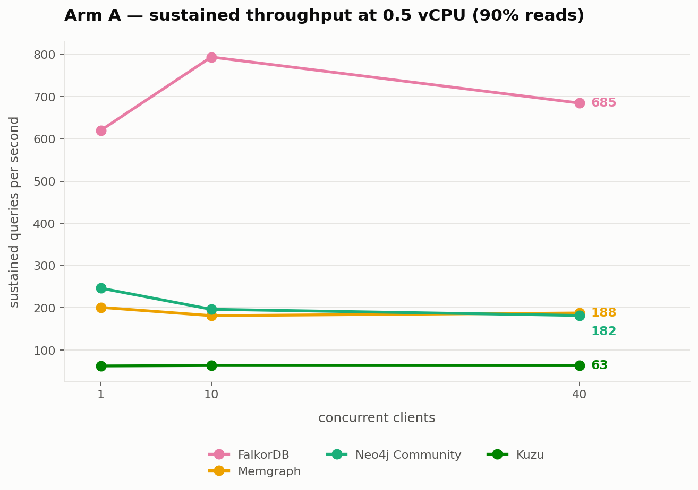
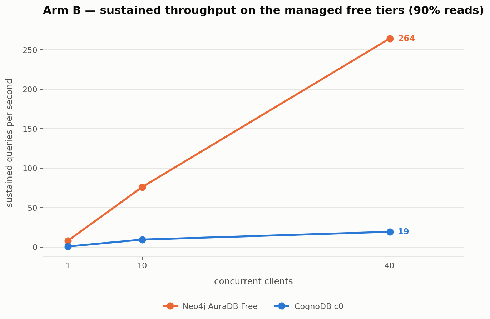

<!-- Generated by `make report`. Do not edit by hand. -->
# Results

## Targets and their advertised specifications

| Target | Arm | Image / endpoint | Advertised | Dialect |
|---|---|---|---|---|
| `cognodb-c0` | managed | `managed service` | vcpu: 0.5 burstable, ram_mb: 512, disk_gb: 1, iops: 500, max_connections: 200 | `cypher5` |
| `falkordb @ 1g` | capped | `falkordb/falkordb:latest` | minimum: not published | `opencypher9` |
| `falkordb @ 2g` | capped | `falkordb/falkordb:latest` | minimum: not published | `opencypher9` |
| `falkordb @ 512m` | capped | `falkordb/falkordb:latest` | minimum: not published | `opencypher9` |
| `kuzu` | capped | `managed service` | not published | `cypher_kuzu` |
| `memgraph @ 1g` | capped | `memgraph/memgraph:latest` | minimum: 1 GB RAM / 1 vCPU / 1 GB disk | `cypher_memgraph` |
| `memgraph @ 2g` | capped | `memgraph/memgraph:latest` | minimum: 1 GB RAM / 1 vCPU / 1 GB disk | `cypher_memgraph` |
| `memgraph @ 512m` | capped | `memgraph/memgraph:latest` | minimum: 1 GB RAM / 1 vCPU / 1 GB disk | `cypher_memgraph` |
| `neo4j-aura-free` | managed | `managed service` | not published | `cypher5` |
| `neo4j-community @ 1g` | capped | `neo4j:5.26-community` | minimum_ram: 2 GB (development), 8 GB (server) | `cypher5` |
| `neo4j-community @ 2g` | capped | `neo4j:5.26-community` | minimum_ram: 2 GB (development), 8 GB (server) | `cypher5` |
| `neo4j-community @ 512m` | capped | `neo4j:5.26-community` | minimum_ram: 2 GB (development), 8 GB (server) | `cypher5` |

## Ingest

_Driver batching, identical batch size on every target. Each engine's faster native path was deliberately not used; see the README._

| Target | Nodes/s | Rels/s | Wall clock | Graph verified |
|---|---:|---:|---:|---|
| `cognodb-c0` | 845 | 1,999 | 190.9s | yes |
| `falkordb @ 1g` | 35,153 | 83,181 | 4.6s | yes |
| `falkordb @ 2g` | 35,913 | 84,979 | 4.5s | yes |
| `falkordb @ 512m` | 34,191 | 80,903 | 4.7s | yes |
| `kuzu` | 134 | 318 | 1,201.0s | yes |
| `memgraph @ 1g` | 1,071 | 2,535 | 150.5s | yes |
| `memgraph @ 2g` | 1,135 | 2,686 | 142.1s | yes |
| `memgraph @ 512m` | 1,057 | 2,502 | 152.5s | yes |
| `neo4j-aura-free` | 1,773 | 4,194 | 91.0s | yes |
| `neo4j-community @ 1g` | 3,516 | 8,321 | 45.9s | yes |
| `neo4j-community @ 2g` | 3,072 | 7,269 | 52.5s | yes |
| `neo4j-community @ 512m` | DNF | DNF | DNF | — |

## Latency by workload

_p50 and p95 only. This client is closed-loop, which under-samples stalls; the distortion is negligible at p50, around 1.5x at p95, and 20x or worse at p99, so no p99 is published from this path. `p95 CI` is a distribution-free confidence interval from order statistics -- where it reads **unbounded**, the sample was too small to close the interval and the p95 should not be quoted._

### Point lookup

| Target | p50 | p95 | p95 CI | mean | server p50 | RTT floor p50 | rows |
|---|---:|---:|---:|---:|---:|---:|---:|
| `cognodb-c0` | 238.26ms | 285.54ms | [272.01, 300.27] | 243.69ms | 0.00ms | 238.10ms | 1 |
| `falkordb @ 1g` | 0.43ms | 0.45ms | [0.45, 0.46] | 0.43ms | 0.02ms | 0.42ms | 1 |
| `falkordb @ 2g` | 0.41ms | 0.44ms | [0.44, 0.45] | 0.41ms | 0.02ms | 0.37ms | 1 |
| `falkordb @ 512m` | 0.43ms | 0.46ms | [0.45, 0.46] | 0.41ms | 0.02ms | 0.43ms | 1 |
| `kuzu` | 0.16ms | 0.19ms | [0.19, 0.19] | 0.16ms | not reported | 0.10ms | 1 |
| `memgraph @ 1g` | 0.40ms | 0.49ms | [0.49, 0.51] | 0.88ms | not reported | 0.40ms | 1 |
| `memgraph @ 2g` | 0.41ms | 0.50ms | [0.49, 0.52] | 0.86ms | not reported | 0.43ms | 1 |
| `memgraph @ 512m` | 0.40ms | 0.66ms | [0.61, 0.79] | 0.93ms | not reported | 0.38ms | 1 |
| `neo4j-aura-free` | 87.28ms | 91.24ms | [90.26, 94.80] | 89.89ms | 1.00ms | 87.45ms | 1 |
| `neo4j-community @ 1g` | 0.83ms | 1.20ms | [1.15, 1.28] | 1.86ms | 0.00ms | 0.97ms | 1 |
| `neo4j-community @ 2g` | 0.77ms | 1.17ms | [1.08, 1.48] | 1.77ms | 0.00ms | 0.94ms | 1 |
| `neo4j-community @ 512m` | DNF | DNF | — | — | — | — | — |

### Filtered lookup (indexed)

| Target | p50 | p95 | p95 CI | mean | server p50 | RTT floor p50 | rows |
|---|---:|---:|---:|---:|---:|---:|---:|
| `cognodb-c0` | 310.03ms | 823.12ms | [810.95, 861.95] | 464.49ms | 0.00ms | 238.10ms | 1000 |
| `falkordb @ 1g` | 2.46ms | 4.91ms | [4.88, 5.28] | 2.75ms | 0.08ms | 0.42ms | 1000 |
| `falkordb @ 2g` | 2.46ms | 4.95ms | [4.89, 5.08] | 2.74ms | 0.08ms | 0.37ms | 1000 |
| `falkordb @ 512m` | 2.51ms | 5.13ms | [5.04, 5.32] | 2.80ms | 0.08ms | 0.43ms | 1000 |
| `kuzu` | 1.74ms | 2.18ms | [2.18, 2.19] | 1.78ms | not reported | 0.10ms | 1000 |
| `memgraph @ 1g` | 5.62ms | 11.38ms | [11.36, 11.42] | 5.97ms | not reported | 0.40ms | 1000 |
| `memgraph @ 2g` | 5.55ms | 11.33ms | [11.31, 11.35] | 5.89ms | not reported | 0.43ms | 1000 |
| `memgraph @ 512m` | 5.73ms | 12.51ms | [12.20, 13.24] | 6.68ms | not reported | 0.38ms | 1000 |
| `neo4j-aura-free` | 184.61ms | 536.24ms | [520.26, 604.95] | 234.01ms | 2.00ms | 87.45ms | 1000 |
| `neo4j-community @ 1g` | 11.36ms | 45.02ms | [40.90, 58.14] | 15.59ms | 1.00ms | 0.97ms | 1000 |
| `neo4j-community @ 2g` | 6.23ms | 12.60ms | [12.52, 12.71] | 6.87ms | 1.00ms | 0.94ms | 1000 |
| `neo4j-community @ 512m` | DNF | DNF | — | — | — | — | — |

### 1-hop traversal

| Target | p50 | p95 | p95 CI | mean | server p50 | RTT floor p50 | rows |
|---|---:|---:|---:|---:|---:|---:|---:|
| `cognodb-c0` | 240.40ms | 327.65ms | [315.65, 338.62] | 257.15ms | 0.00ms | 238.10ms | 3 |
| `falkordb @ 1g` | 0.44ms | 0.50ms | [0.49, 0.52] | 0.45ms | 0.04ms | 0.42ms | 2 |
| `falkordb @ 2g` | 0.45ms | 0.52ms | [0.51, 0.55] | 0.46ms | 0.03ms | 0.37ms | 2 |
| `falkordb @ 512m` | 0.45ms | 0.52ms | [0.51, 0.54] | 0.45ms | 0.04ms | 0.43ms | 2 |
| `kuzu` | 0.62ms | 0.86ms | [0.83, 0.91] | 0.65ms | not reported | 0.10ms | 3 |
| `memgraph @ 1g` | 0.46ms | 0.72ms | [0.64, 0.95] | 0.98ms | not reported | 0.40ms | 3 |
| `memgraph @ 2g` | 0.47ms | 0.76ms | [0.71, 0.97] | 0.98ms | not reported | 0.43ms | 3 |
| `memgraph @ 512m` | 0.48ms | 0.93ms | [0.81, 1.21] | 1.07ms | not reported | 0.38ms | 3 |
| `neo4j-aura-free` | 87.84ms | 101.30ms | [97.76, 108.07] | 91.21ms | 1.00ms | 87.45ms | 3 |
| `neo4j-community @ 1g` | 0.81ms | 1.34ms | [1.22, 1.59] | 1.16ms | 0.00ms | 0.97ms | 3 |
| `neo4j-community @ 2g` | 0.74ms | 1.30ms | [1.14, 1.62] | 1.06ms | 0.00ms | 0.94ms | 3 |
| `neo4j-community @ 512m` | DNF | DNF | — | — | — | — | — |

### 2-hop traversal

| Target | p50 | p95 | p95 CI | mean | server p50 | RTT floor p50 | rows |
|---|---:|---:|---:|---:|---:|---:|---:|
| `cognodb-c0` | 259.91ms | 726.84ms | [596.12, 766.12] | 362.96ms | 0.00ms | 238.10ms | 1000 |
| `falkordb @ 1g` | 0.50ms | 0.88ms | [0.80, 1.08] | 0.59ms | 0.05ms | 0.42ms | 13 |
| `falkordb @ 2g` | 0.53ms | 0.87ms | [0.81, 1.09] | 0.61ms | 0.05ms | 0.37ms | 13 |
| `falkordb @ 512m` | 0.54ms | 0.90ms | [0.85, 1.10] | 0.62ms | 0.05ms | 0.43ms | 13 |
| `kuzu` | 47.66ms | 53.75ms | [53.12, 55.29] | 49.46ms | not reported | 0.10ms | 1000 |
| `memgraph @ 1g` | 1.41ms | 6.44ms | [5.65, 8.75] | 2.06ms | not reported | 0.40ms | 1000 |
| `memgraph @ 2g` | 1.39ms | 6.44ms | [5.53, 8.64] | 2.02ms | not reported | 0.43ms | 1000 |
| `memgraph @ 512m` | 1.50ms | 6.99ms | [6.26, 8.98] | 2.20ms | not reported | 0.38ms | 1000 |
| `neo4j-aura-free` | 91.68ms | 139.07ms | [115.58, 203.44] | 99.25ms | 1.00ms | 87.45ms | 1000 |
| `neo4j-community @ 1g` | 2.13ms | 10.67ms | [8.18, 11.62] | 3.37ms | 0.00ms | 0.97ms | 1000 |
| `neo4j-community @ 2g` | 1.84ms | 9.64ms | [7.84, 11.16] | 3.21ms | 0.00ms | 0.94ms | 1000 |
| `neo4j-community @ 512m` | DNF | DNF | — | — | — | — | — |

### 3-hop traversal

| Target | p50 | p95 | p95 CI | mean | server p50 | RTT floor p50 | rows |
|---|---:|---:|---:|---:|---:|---:|---:|
| `cognodb-c0` | 739.18ms | 1,002.06ms | [920.65, 1,047.93] | 726.48ms | 0.00ms | 238.10ms | 1000 |
| `falkordb @ 1g` | 3.08ms | 3.39ms | [3.32, 3.44] | 2.64ms | 0.23ms | 0.42ms | 1000 |
| `falkordb @ 2g` | 3.08ms | 3.41ms | [3.36, 3.56] | 2.65ms | 0.23ms | 0.37ms | 1000 |
| `falkordb @ 512m` | 3.13ms | 3.56ms | [3.45, 3.93] | 2.71ms | 0.24ms | 0.43ms | 1000 |
| `kuzu` | 50.74ms | 56.47ms | [55.64, 57.68] | 51.40ms | not reported | 0.10ms | 1000 |
| `memgraph @ 1g` | 9.31ms | 9.54ms | [9.50, 9.59] | 8.41ms | not reported | 0.40ms | 1000 |
| `memgraph @ 2g` | 9.27ms | 9.52ms | [9.48, 9.60] | 8.42ms | not reported | 0.43ms | 1000 |
| `memgraph @ 512m` | 9.39ms | 10.84ms | [10.47, 11.29] | 8.80ms | not reported | 0.38ms | 1000 |
| `neo4j-aura-free` | 201.64ms | 274.90ms | [271.47, 285.64] | 194.72ms | 3.00ms | 87.45ms | 1000 |
| `neo4j-community @ 1g` | 11.55ms | 12.60ms | [12.44, 12.85] | 11.22ms | 1.00ms | 0.97ms | 1000 |
| `neo4j-community @ 2g` | 11.14ms | 12.36ms | [12.03, 12.78] | 10.44ms | 1.00ms | 0.94ms | 1000 |
| `neo4j-community @ 512m` | DNF | DNF | — | — | — | — | — |

### Aggregation (group-by)

| Target | p50 | p95 | p95 CI | mean | server p50 | RTT floor p50 | rows |
|---|---:|---:|---:|---:|---:|---:|---:|
| `cognodb-c0` | 331.27ms | 417.01ms | [407.25, 436.17] | 346.90ms | 0.00ms | 238.10ms | 40 |
| `falkordb @ 1g` | 3.29ms | 40.80ms | [5.06, 42.14] | 5.57ms | 2.69ms | 0.42ms | 40 |
| `falkordb @ 2g` | 3.25ms | 40.69ms | [3.74, 42.66] | 5.51ms | 2.69ms | 0.37ms | 40 |
| `falkordb @ 512m` | 3.30ms | 41.63ms | [4.55, 43.14] | 5.68ms | 2.72ms | 0.43ms | 40 |
| `kuzu` | 0.97ms | 1.05ms | [1.04, 1.07] | 0.98ms | not reported | 0.10ms | 40 |
| `memgraph @ 1g` | 11.87ms | 63.81ms | [62.67, 64.54] | 23.50ms | not reported | 0.40ms | 40 |
| `memgraph @ 2g` | 11.53ms | 62.46ms | [62.22, 62.98] | 22.86ms | not reported | 0.43ms | 40 |
| `memgraph @ 512m` | 11.76ms | 63.97ms | [63.28, 64.96] | 23.18ms | not reported | 0.38ms | 40 |
| `neo4j-aura-free` | 97.08ms | 108.32ms | [106.19, 113.10] | 99.40ms | 8.00ms | 87.45ms | 40 |
| `neo4j-community @ 1g` | 3.70ms | 47.06ms | [40.24, 53.48] | 8.10ms | 3.00ms | 0.97ms | 40 |
| `neo4j-community @ 2g` | 3.53ms | 46.60ms | [39.33, 57.87] | 8.40ms | 3.00ms | 0.94ms | 40 |
| `neo4j-community @ 512m` | DNF | DNF | — | — | — | — | — |

### Write (indexed update)

| Target | p50 | p95 | p95 CI | mean | server p50 | RTT floor p50 | rows |
|---|---:|---:|---:|---:|---:|---:|---:|
| `cognodb-c0` | 3,871.26ms | 4,866.65ms | [4,737.78, 6,796.57] | 4,027.65ms | 0.00ms | 238.10ms | 1 |
| `falkordb @ 1g` | 0.44ms | 0.48ms | [0.48, 0.49] | 0.44ms | 0.03ms | 0.42ms | 1 |
| `falkordb @ 2g` | 0.43ms | 0.45ms | [0.45, 0.46] | 0.42ms | 0.02ms | 0.37ms | 1 |
| `falkordb @ 512m` | 0.43ms | 0.48ms | [0.47, 0.49] | 0.43ms | 0.03ms | 0.43ms | 1 |
| `kuzu` | 0.28ms | 0.35ms | [0.33, 0.37] | 0.29ms | not reported | 0.10ms | 1 |
| `memgraph @ 1g` | 0.42ms | 0.52ms | [0.51, 0.54] | 0.89ms | not reported | 0.40ms | 1 |
| `memgraph @ 2g` | 0.42ms | 0.52ms | [0.51, 0.54] | 0.89ms | not reported | 0.43ms | 1 |
| `memgraph @ 512m` | 0.43ms | 0.63ms | [0.59, 0.66] | 0.95ms | not reported | 0.38ms | 1 |
| `neo4j-aura-free` | 91.91ms | 103.15ms | [100.00, 108.76] | 96.50ms | 1.00ms | 87.45ms | 1 |
| `neo4j-community @ 1g` | 0.78ms | 1.48ms | [1.39, 1.75] | 1.79ms | 0.00ms | 0.97ms | 1 |
| `neo4j-community @ 2g` | 0.87ms | 7.38ms | [4.91, 28.08] | 3.68ms | 0.00ms | 0.94ms | 1 |
| `neo4j-community @ 512m` | DNF | DNF | — | — | — | — | — |

## Mixed workload -- sustained throughput

_Read/write mix **90% reads, 10% writes**, at client concurrencies of **1, 10 and 40**. The achieved ratio is reported per level rather than assumed. Throughput counts operations the target accepted: FalkorDB sheds load past a bounded queue and its failure count is listed alongside, where Memgraph and Neo4j queue instead and pay in latency._

| Target | Clients | Sustained q/s | p50 | p95 | Reads | Writes | Failures |
|---|---:|---:|---:|---:|---:|---:|---:|
| `cognodb-c0` | 1 | 0.7 | 479.30ms | 4,229.02ms | 17 | 5 | 0 |
| `cognodb-c0` | 10 | 9.5 | 576.66ms | 4,752.47ms | 257 | 28 | 0 |
| `cognodb-c0` | 40 | 19.4 | 855.27ms | 13,471.63ms | 526 | 55 | 0 |
| `falkordb @ 1g` | 1 | 624.6 | 0.60ms | 4.64ms | 16,895 | 1,843 | 0 |
| `falkordb @ 1g` | 10 | 782.5 | 7.34ms | 52.02ms | 21,118 | 2,357 | 0 |
| `falkordb @ 1g` | 40 | 731.5 | 42.33ms | 113.82ms | 19,751 | 2,194 | 1,404 |
| `falkordb @ 2g` | 1 | 620.3 | 0.61ms | 4.68ms | 16,786 | 1,824 | 0 |
| `falkordb @ 2g` | 10 | 793.7 | 7.34ms | 49.88ms | 21,416 | 2,396 | 0 |
| `falkordb @ 2g` | 40 | 684.8 | 45.72ms | 118.67ms | 18,487 | 2,058 | 1,330 |
| `falkordb @ 512m` | 1 | 609.9 | 0.62ms | 4.73ms | 16,498 | 1,798 | 0 |
| `falkordb @ 512m` | 10 | 706.2 | 7.67ms | 57.58ms | 19,059 | 2,128 | 0 |
| `falkordb @ 512m` | 40 | 667.2 | 46.02ms | 125.73ms | 18,015 | 2,000 | 1,337 |
| `kuzu` | 1 | 62.5 | 1.20ms | 51.77ms | 1,713 | 162 | 0 |
| `kuzu` | 10 | 63.5 | 115.49ms | 389.92ms | 1,720 | 185 | 0 |
| `kuzu` | 40 | 63.3 | 357.11ms | 1,495.85ms | 1,727 | 173 | 0 |
| `memgraph @ 1g` | 1 | 194.3 | 1.60ms | 11.58ms | 5,259 | 570 | 0 |
| `memgraph @ 1g` | 10 | 181.3 | 41.99ms | 161.49ms | 4,904 | 536 | 0 |
| `memgraph @ 1g` | 40 | 181.9 | 181.29ms | 529.60ms | 4,929 | 529 | 0 |
| `memgraph @ 2g` | 1 | 201.1 | 1.57ms | 11.30ms | 5,447 | 586 | 0 |
| `memgraph @ 2g` | 10 | 181.5 | 41.57ms | 160.84ms | 4,903 | 542 | 0 |
| `memgraph @ 2g` | 40 | 187.8 | 177.00ms | 508.16ms | 5,085 | 548 | 0 |
| `memgraph @ 512m` | 1 | 191.7 | 1.63ms | 11.66ms | 5,186 | 565 | 0 |
| `memgraph @ 512m` | 10 | 175.0 | 42.76ms | 167.81ms | 4,737 | 513 | 0 |
| `memgraph @ 512m` | 40 | 149.7 | 201.05ms | 707.31ms | 4,050 | 442 | 0 |
| `neo4j-aura-free` | 1 | 7.9 | 93.72ms | 274.79ms | 215 | 23 | 0 |
| `neo4j-aura-free` | 10 | 76.0 | 99.60ms | 254.80ms | 2,056 | 225 | 0 |
| `neo4j-aura-free` | 40 | 264.3 | 116.80ms | 311.94ms | 7,147 | 782 | 0 |
| `neo4j-community @ 1g` | 1 | 241.6 | 1.98ms | 12.20ms | 6,545 | 702 | 0 |
| `neo4j-community @ 1g` | 10 | 187.4 | 11.93ms | 222.70ms | 5,066 | 556 | 0 |
| `neo4j-community @ 1g` | 40 | 179.5 | 39.19ms | 1,003.60ms | 4,860 | 524 | 0 |
| `neo4j-community @ 2g` | 1 | 246.5 | 1.88ms | 12.09ms | 6,681 | 713 | 0 |
| `neo4j-community @ 2g` | 10 | 196.5 | 11.94ms | 213.67ms | 5,313 | 581 | 0 |
| `neo4j-community @ 2g` | 40 | 182.0 | 39.79ms | 987.39ms | 4,926 | 533 | 0 |

## Cold start versus steady state

_A trivial round trip against a freshly started engine holding no data, against the same round trip once the graph is loaded. Reported separately, never averaged together._

| Target | Cold p50 | Cold p95 | Warm p50 | Warm p95 | Cold/warm ratio |
|---|---:|---:|---:|---:|---:|
| `cognodb-c0` | 238.87ms | 270.50ms | 238.10ms | 298.79ms | 1.00x |
| `falkordb @ 1g` | 0.41ms | 0.43ms | 0.42ms | 0.44ms | 0.98x |
| `falkordb @ 2g` | 0.41ms | 0.43ms | 0.37ms | 0.42ms | 1.11x |
| `falkordb @ 512m` | 0.43ms | 0.47ms | 0.43ms | 0.46ms | 1.00x |
| `kuzu` | 0.08ms | 0.13ms | 0.10ms | 0.12ms | 0.88x |
| `memgraph @ 1g` | 0.41ms | 1.02ms | 0.40ms | 0.47ms | 1.01x |
| `memgraph @ 2g` | 0.39ms | 0.46ms | 0.43ms | 0.67ms | 0.91x |
| `memgraph @ 512m` | 0.38ms | 0.47ms | 0.38ms | 0.47ms | 0.98x |
| `neo4j-aura-free` | 87.45ms | 96.75ms | 87.45ms | 92.58ms | 1.00x |
| `neo4j-community @ 1g` | 2.11ms | 61.87ms | 0.97ms | 1.66ms | 2.17x |
| `neo4j-community @ 2g` | 2.11ms | 70.64ms | 0.94ms | 1.42ms | 2.25x |

## Footprint

| Target | Stored | Memory | Nodes | Relationships | Enforced cgroup |
|---|---:|---:|---:|---:|---|
| `cognodb-c0` | not observable | not observable | 161,236 | 381,523 | not containerised |
| `falkordb @ 1g` | not observable | 105.2 MiB | 161,236 | 381,523 | `cpu.max=50000 100000` `memory.max=1073741824` |
| `falkordb @ 2g` | not observable | 104.8 MiB | 161,236 | 381,523 | `cpu.max=50000 100000` `memory.max=2147483648` |
| `falkordb @ 512m` | not observable | 105.3 MiB | 161,236 | 381,523 | `cpu.max=50000 100000` `memory.max=536870912` |
| `kuzu` | 89.1 MiB | not observable | 161,236 | 381,523 | not containerised |
| `memgraph @ 1g` | not observable | not observable | 161,236 | 381,523 | `cpu.max=50000 100000` `memory.max=1073741824` |
| `memgraph @ 2g` | not observable | not observable | 161,236 | 381,523 | `cpu.max=50000 100000` `memory.max=2147483648` |
| `memgraph @ 512m` | not observable | not observable | 161,236 | 381,523 | `cpu.max=50000 100000` `memory.max=536870912` |
| `neo4j-aura-free` | not observable | not observable | 161,236 | 381,523 | not containerised |
| `neo4j-community @ 1g` | not observable | not observable | 161,236 | 381,523 | `cpu.max=50000 100000` `memory.max=1073741824` |
| `neo4j-community @ 2g` | not observable | not observable | 161,236 | 381,523 | `cpu.max=50000 100000` `memory.max=2147483648` |
| `neo4j-community @ 512m` | DNF | DNF | — | — | — |

## Failures and did-not-finish

| Target | Outcome | Reason | Detail |
|---|---|---|---|
| `neo4j-community @ 512m` | DNF | out of memory | exit=137, oom_killed=True |

## Run-to-run variance

_The full suite was executed **3 times**. The 1,000 iterations within each run give a confidence interval on each percentile; they say nothing about variation *between* runs, which has larger sources -- multi-tenant free tiers, differing cache states at container start, burstable CPU credit, and host thermal state. A difference between two engines smaller than either one's own spread is not a difference._

Median coefficient of variation across 99 repeated measurements: **0.024**. Measurements marked ⚠ exceed a coefficient of variation of 0.10 and should not be compared across engines without accounting for the spread.

### Least stable measurements (3)

_Listed first because these are the numbers a reader is most likely to over-interpret._

| Target | Metric | Runs | Median | Min | Max | Spread | CV |
|---|---|---:|---:|---:|---:|---:|---:|
| `falkordb @ 1g` | ingest rels/s | 3 | 83,180.98 | 69,428.65 | 83,463.45 | 16.9% | 0.102 ⚠ |
| `memgraph @ 512m` | 40-client q/s | 3 | 149.73 | 147.47 | 183.07 | 23.8% | 0.125 ⚠ |
| `neo4j-community @ 1g` | filtered_lookup p50 ms | 3 | 6.33 | 6.10 | 11.36 | 83.1% | 0.375 ⚠ |

### Latency, across runs

| Target | Metric | Runs | Median | Min | Max | Spread | CV |
|---|---|---:|---:|---:|---:|---:|---:|
| `falkordb @ 1g` | aggregation p50 ms | 3 | 3.32 | 3.29 | 3.43 | 4.2% | 0.022 |
| `falkordb @ 1g` | filtered_lookup p50 ms | 3 | 2.53 | 2.46 | 2.54 | 3.1% | 0.017 |
| `falkordb @ 1g` | hop1 p50 ms | 3 | 0.43 | 0.43 | 0.44 | 3.4% | 0.017 |
| `falkordb @ 1g` | hop2 p50 ms | 3 | 0.52 | 0.50 | 0.54 | 6.7% | 0.034 |
| `falkordb @ 1g` | hop3 p50 ms | 3 | 3.16 | 3.08 | 3.23 | 4.7% | 0.024 |
| `falkordb @ 1g` | point_lookup p50 ms | 3 | 0.39 | 0.38 | 0.43 | 11.7% | 0.061 |
| `falkordb @ 1g` | write_tag p50 ms | 3 | 0.44 | 0.44 | 0.44 | 0.9% | 0.005 |
| `falkordb @ 2g` | aggregation p50 ms | 3 | 3.27 | 3.25 | 3.37 | 3.8% | 0.020 |
| `falkordb @ 2g` | filtered_lookup p50 ms | 3 | 2.50 | 2.46 | 2.50 | 1.8% | 0.010 |
| `falkordb @ 2g` | hop1 p50 ms | 3 | 0.45 | 0.44 | 0.45 | 2.5% | 0.013 |
| `falkordb @ 2g` | hop2 p50 ms | 3 | 0.53 | 0.53 | 0.53 | 1.2% | 0.006 |
| `falkordb @ 2g` | hop3 p50 ms | 3 | 3.12 | 3.08 | 3.17 | 2.8% | 0.014 |
| `falkordb @ 2g` | point_lookup p50 ms | 3 | 0.41 | 0.41 | 0.42 | 3.4% | 0.017 |
| `falkordb @ 2g` | write_tag p50 ms | 3 | 0.43 | 0.43 | 0.43 | 0.9% | 0.005 |
| `falkordb @ 512m` | aggregation p50 ms | 3 | 3.30 | 3.27 | 3.30 | 0.7% | 0.004 |
| `falkordb @ 512m` | filtered_lookup p50 ms | 3 | 2.49 | 2.48 | 2.51 | 1.4% | 0.007 |
| `falkordb @ 512m` | hop1 p50 ms | 3 | 0.45 | 0.44 | 0.46 | 3.6% | 0.018 |
| `falkordb @ 512m` | hop2 p50 ms | 3 | 0.54 | 0.53 | 0.54 | 2.9% | 0.015 |
| `falkordb @ 512m` | hop3 p50 ms | 3 | 3.13 | 3.10 | 3.18 | 2.5% | 0.012 |
| `falkordb @ 512m` | point_lookup p50 ms | 3 | 0.43 | 0.42 | 0.43 | 1.3% | 0.007 |
| `falkordb @ 512m` | write_tag p50 ms | 3 | 0.43 | 0.42 | 0.43 | 4.0% | 0.020 |
| `kuzu` | aggregation p50 ms | 3 | 0.99 | 0.97 | 1.03 | 6.0% | 0.030 |
| `kuzu` | filtered_lookup p50 ms | 3 | 1.73 | 1.70 | 1.74 | 2.1% | 0.011 |
| `kuzu` | hop1 p50 ms | 3 | 0.62 | 0.61 | 0.65 | 7.2% | 0.037 |
| `kuzu` | hop2 p50 ms | 3 | 48.39 | 47.66 | 48.81 | 2.4% | 0.012 |
| `kuzu` | hop3 p50 ms | 3 | 50.94 | 50.74 | 51.71 | 1.9% | 0.010 |
| `kuzu` | point_lookup p50 ms | 3 | 0.16 | 0.15 | 0.16 | 1.8% | 0.010 |
| `kuzu` | write_tag p50 ms | 3 | 0.27 | 0.27 | 0.28 | 3.0% | 0.016 |
| `memgraph @ 1g` | aggregation p50 ms | 3 | 11.75 | 11.53 | 11.87 | 2.9% | 0.015 |
| `memgraph @ 1g` | filtered_lookup p50 ms | 3 | 5.57 | 5.48 | 5.62 | 2.5% | 0.013 |
| `memgraph @ 1g` | hop1 p50 ms | 3 | 0.48 | 0.46 | 0.48 | 5.5% | 0.030 |
| `memgraph @ 1g` | hop2 p50 ms | 3 | 1.41 | 1.38 | 1.49 | 7.9% | 0.041 |
| `memgraph @ 1g` | hop3 p50 ms | 3 | 9.31 | 9.17 | 9.40 | 2.5% | 0.013 |
| `memgraph @ 1g` | point_lookup p50 ms | 3 | 0.40 | 0.39 | 0.41 | 5.4% | 0.027 |
| `memgraph @ 1g` | write_tag p50 ms | 3 | 0.42 | 0.42 | 0.44 | 3.9% | 0.021 |
| `memgraph @ 2g` | aggregation p50 ms | 3 | 11.60 | 11.53 | 12.10 | 4.9% | 0.026 |
| `memgraph @ 2g` | filtered_lookup p50 ms | 3 | 5.55 | 5.50 | 5.55 | 0.9% | 0.005 |
| `memgraph @ 2g` | hop1 p50 ms | 3 | 0.47 | 0.47 | 0.49 | 4.2% | 0.022 |
| `memgraph @ 2g` | hop2 p50 ms | 3 | 1.39 | 1.37 | 1.43 | 5.0% | 0.026 |
| `memgraph @ 2g` | hop3 p50 ms | 3 | 9.27 | 9.19 | 9.27 | 0.9% | 0.005 |
| `memgraph @ 2g` | point_lookup p50 ms | 3 | 0.41 | 0.38 | 0.41 | 7.3% | 0.041 |
| `memgraph @ 2g` | write_tag p50 ms | 3 | 0.42 | 0.42 | 0.46 | 8.7% | 0.046 |
| `memgraph @ 512m` | aggregation p50 ms | 3 | 11.76 | 11.67 | 11.85 | 1.5% | 0.007 |
| `memgraph @ 512m` | filtered_lookup p50 ms | 3 | 5.36 | 5.35 | 5.73 | 6.9% | 0.039 |
| `memgraph @ 512m` | hop1 p50 ms | 3 | 0.48 | 0.48 | 0.48 | 1.0% | 0.005 |
| `memgraph @ 512m` | hop2 p50 ms | 3 | 1.38 | 1.37 | 1.50 | 9.7% | 0.051 |
| `memgraph @ 512m` | hop3 p50 ms | 3 | 9.12 | 9.09 | 9.39 | 3.4% | 0.018 |
| `memgraph @ 512m` | point_lookup p50 ms | 3 | 0.40 | 0.37 | 0.42 | 13.0% | 0.066 |
| `memgraph @ 512m` | write_tag p50 ms | 3 | 0.43 | 0.42 | 0.44 | 5.2% | 0.026 |
| `neo4j-community @ 1g` | aggregation p50 ms | 3 | 3.70 | 3.46 | 3.71 | 6.7% | 0.039 |
| `neo4j-community @ 1g` | filtered_lookup p50 ms | 3 | 6.33 | 6.10 | 11.36 | 83.1% | 0.375 ⚠ |
| `neo4j-community @ 1g` | hop1 p50 ms | 3 | 0.81 | 0.75 | 0.86 | 14.7% | 0.074 |
| `neo4j-community @ 1g` | hop2 p50 ms | 3 | 2.00 | 1.90 | 2.13 | 11.4% | 0.057 |
| `neo4j-community @ 1g` | hop3 p50 ms | 3 | 11.37 | 10.95 | 11.55 | 5.3% | 0.027 |
| `neo4j-community @ 1g` | point_lookup p50 ms | 3 | 0.83 | 0.78 | 0.87 | 10.8% | 0.054 |
| `neo4j-community @ 1g` | write_tag p50 ms | 3 | 0.80 | 0.78 | 0.84 | 7.2% | 0.037 |
| `neo4j-community @ 2g` | aggregation p50 ms | 3 | 3.40 | 3.38 | 3.53 | 4.3% | 0.023 |
| `neo4j-community @ 2g` | filtered_lookup p50 ms | 3 | 6.23 | 6.18 | 6.32 | 2.3% | 0.012 |
| `neo4j-community @ 2g` | hop1 p50 ms | 3 | 0.74 | 0.74 | 0.77 | 4.9% | 0.026 |
| `neo4j-community @ 2g` | hop2 p50 ms | 3 | 1.84 | 1.81 | 1.94 | 7.2% | 0.037 |
| `neo4j-community @ 2g` | hop3 p50 ms | 3 | 11.14 | 10.98 | 11.20 | 2.0% | 0.010 |
| `neo4j-community @ 2g` | point_lookup p50 ms | 3 | 0.77 | 0.75 | 0.81 | 7.2% | 0.037 |
| `neo4j-community @ 2g` | write_tag p50 ms | 3 | 0.79 | 0.78 | 0.87 | 11.7% | 0.063 |

### Ingest, across runs

| Target | Metric | Runs | Median | Min | Max | Spread | CV |
|---|---|---:|---:|---:|---:|---:|---:|
| `falkordb @ 1g` | ingest rels/s | 3 | 83,180.98 | 69,428.65 | 83,463.45 | 16.9% | 0.102 ⚠ |
| `falkordb @ 2g` | ingest rels/s | 3 | 84,195.51 | 81,140.17 | 84,979.15 | 4.6% | 0.024 |
| `falkordb @ 512m` | ingest rels/s | 3 | 82,861.70 | 80,903.08 | 85,988.76 | 6.1% | 0.031 |
| `kuzu` | ingest rels/s | 3 | 317.66 | 313.67 | 319.70 | 1.9% | 0.010 |
| `memgraph @ 1g` | ingest rels/s | 3 | 2,646.05 | 2,534.72 | 2,660.02 | 4.7% | 0.026 |
| `memgraph @ 2g` | ingest rels/s | 3 | 2,685.60 | 2,671.92 | 2,686.30 | 0.5% | 0.003 |
| `memgraph @ 512m` | ingest rels/s | 3 | 2,664.08 | 2,501.92 | 2,675.60 | 6.5% | 0.037 |
| `neo4j-community @ 1g` | ingest rels/s | 3 | 8,320.56 | 7,967.19 | 8,573.17 | 7.3% | 0.037 |
| `neo4j-community @ 2g` | ingest rels/s | 3 | 8,121.32 | 7,268.58 | 8,323.48 | 13.0% | 0.071 |

### Throughput, across runs

| Target | Metric | Runs | Median | Min | Max | Spread | CV |
|---|---|---:|---:|---:|---:|---:|---:|
| `falkordb @ 1g` | 1-client q/s | 3 | 608.20 | 607.63 | 624.60 | 2.8% | 0.016 |
| `falkordb @ 1g` | 10-client q/s | 3 | 776.93 | 776.77 | 782.50 | 0.7% | 0.004 |
| `falkordb @ 1g` | 40-client q/s | 3 | 724.80 | 719.03 | 731.50 | 1.7% | 0.009 |
| `falkordb @ 2g` | 1-client q/s | 3 | 620.33 | 593.13 | 622.17 | 4.7% | 0.027 |
| `falkordb @ 2g` | 10-client q/s | 3 | 766.47 | 739.33 | 793.73 | 7.1% | 0.035 |
| `falkordb @ 2g` | 40-client q/s | 3 | 684.83 | 651.37 | 722.77 | 10.4% | 0.052 |
| `falkordb @ 512m` | 1-client q/s | 3 | 610.07 | 609.87 | 611.63 | 0.3% | 0.002 |
| `falkordb @ 512m` | 10-client q/s | 3 | 725.37 | 706.23 | 757.27 | 7.0% | 0.035 |
| `falkordb @ 512m` | 40-client q/s | 3 | 714.87 | 667.17 | 747.63 | 11.3% | 0.057 |
| `kuzu` | 1-client q/s | 3 | 63.17 | 62.50 | 63.97 | 2.3% | 0.012 |
| `kuzu` | 10-client q/s | 3 | 63.50 | 62.10 | 63.90 | 2.8% | 0.015 |
| `kuzu` | 40-client q/s | 3 | 63.33 | 61.47 | 63.90 | 3.8% | 0.020 |
| `memgraph @ 1g` | 1-client q/s | 3 | 194.30 | 189.10 | 200.00 | 5.6% | 0.028 |
| `memgraph @ 1g` | 10-client q/s | 3 | 181.33 | 172.53 | 182.00 | 5.2% | 0.030 |
| `memgraph @ 1g` | 40-client q/s | 3 | 181.93 | 158.23 | 190.23 | 17.6% | 0.094 |
| `memgraph @ 2g` | 1-client q/s | 3 | 196.60 | 187.40 | 201.10 | 7.0% | 0.036 |
| `memgraph @ 2g` | 10-client q/s | 3 | 179.97 | 167.83 | 181.50 | 7.6% | 0.042 |
| `memgraph @ 2g` | 40-client q/s | 3 | 187.77 | 171.20 | 190.43 | 10.2% | 0.057 |
| `memgraph @ 512m` | 1-client q/s | 3 | 193.83 | 191.70 | 195.07 | 1.7% | 0.009 |
| `memgraph @ 512m` | 10-client q/s | 3 | 175.00 | 166.47 | 177.67 | 6.4% | 0.034 |
| `memgraph @ 512m` | 40-client q/s | 3 | 149.73 | 147.47 | 183.07 | 23.8% | 0.125 ⚠ |
| `neo4j-community @ 1g` | 1-client q/s | 3 | 241.57 | 233.63 | 260.63 | 11.2% | 0.057 |
| `neo4j-community @ 1g` | 10-client q/s | 3 | 194.10 | 187.40 | 199.20 | 6.1% | 0.031 |
| `neo4j-community @ 1g` | 40-client q/s | 3 | 186.13 | 179.47 | 191.47 | 6.4% | 0.032 |
| `neo4j-community @ 2g` | 1-client q/s | 3 | 249.87 | 246.47 | 253.70 | 2.9% | 0.014 |
| `neo4j-community @ 2g` | 10-client q/s | 3 | 196.47 | 194.43 | 198.90 | 2.3% | 0.011 |
| `neo4j-community @ 2g` | 40-client q/s | 3 | 187.53 | 181.97 | 189.83 | 4.2% | 0.022 |

## Charts

### Latency by workload — Arm A, identical cgroup limits

### Latency by workload — Arm B, managed free tiers

### Latency against the container memory limit

### Sustained throughput against concurrency — Arm A

### Sustained throughput against concurrency — Arm B

### Server execution time versus network time

### Warm-up curves

